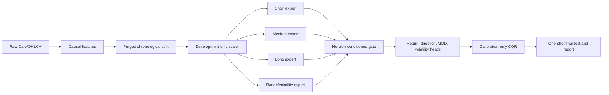

# MSDP — Multi-Scale Distributional Predictor for VN-Index

MSDP is a leakage-aware research pipeline for direct 5-, 20- and 60-session probabilistic VN-Index forecasts. It predicts ordered return and maximum-drawdown quantiles, probability of a positive return, realized volatility, and horizon-specific weights for four temporal experts. This repository is research software, not investment advice.



## Input

`Date` and positive `Close` are required (case-insensitive). `Open`, `High`, `Low`, and `Volume` are optional; unavailable feature groups are skipped. Dates are sorted, duplicate dates retain the last record, and trading holidays are neither inserted nor forward-filled. The included source file has unquoted comma thousands separators; the loader reconstructs it under OHLC constraints without changing the original.

## Windows installation

With Miniconda in PowerShell:

```powershell
conda create -n msdp python=3.11 -y
conda activate msdp
pip install -r requirements.txt
```

Or with a standard Python installation:

```powershell
py -3.11 -m venv .venv
.\.venv\Scripts\Activate.ps1
python -m pip install --upgrade pip
pip install -r requirements.txt
```

## Commands

```powershell
python scripts/inspect_data.py --data data/raw/VNINDEX_Daily.csv
pytest -q
python scripts/run_all.py --config configs/quick.yaml --data data/raw/VNINDEX_Daily.csv
python scripts/run_all.py --config configs/default.yaml --data data/raw/VNINDEX_Daily.csv
python scripts/predict_latest.py --config configs/default.yaml --data data/raw/VNINDEX_Daily.csv --model artifacts/models/production_model.pt
```

`quick.yaml` uses one seed and three epochs for an installation/smoke check. `default.yaml` is the research configuration. The latter requires substantial CPU time. Important settings include lookback, purge gap, chronological split minima, quantiles, expert size, learning rate, batch size, early stopping and calibration coverage.

## Outputs

- `data/processed/feature_metadata.csv`: formula, group, lookback and input requirements.
- `artifacts/models/`: evaluation and production bundles, including exact feature order.
- `artifacts/scalers/`: development-fitted feature scaler.
- `artifacts/predictions/test_predictions.csv`: forecasts, outcomes, intervals and gate weights.
- `artifacts/predictions/latest_forecast.*`: machine- and human-readable forecast profile.
- `reports/MSDP_Report.*`, `reports/tables/`, `reports/figures/`: generated evidence.
- `artifacts/run_metadata.json`: config, data hash, environment, dates and commit.

Metrics cover return MAE/RMSE/pinball/Spearman/sign accuracy; direction Brier/log loss/AUC/balanced accuracy/F1/MCC; MDD pinball/MAE; volatility MAE/RMSE; and interval coverage/width/Winkler score. A forecast at three horizons is a horizon profile, not a future price path.

## Leakage safeguards

All rolling features end at time `t`. Forward targets never enter the feature matrix. Partitions are chronological and separated by the maximum 60-session horizon. Missing-value medians and the robust scaler use development rows only. Early stopping uses a purged tail of development. CQR uses calibration only, and test metrics do not select parameters. The production bundle is separate from reported evaluation outputs.

## Structure

Core modules live in `src/msdp`; entry points are in `scripts`; tests are in `tests`; configuration is under `configs`. The raw input remains in `data/raw`, while generated data is under `data/processed`.

## Reproducibility and limitations

The seed, deterministic PyTorch settings, package/platform metadata, source hash and configuration snapshot are recorded. Exact floating-point identity can still vary across PyTorch builds and hardware. Financial regimes change; calibration coverage is empirical rather than an iid finite-sample guarantee. Wide intervals, unstable gates or confidence scores must not be interpreted as certainty. Baseline superiority should only be claimed when paired moving-block bootstrap evidence excludes zero.

Troubleshooting: if `python` opens Microsoft Store, install Miniconda or Python 3.11 and reopen the terminal. If the loader rejects a row, export CSV fields with thousands separators quoted or disabled. If the series is too short, use `quick.yaml`; do not reduce the 60-session purge for final research.

