# MSDP � B? d? b�o ph�n ph?i da thang do cho VN-Index

## T�m t?t nghi�n c?u

MSDP d? b�o tr?c ti?p ph�n ph?i l?i su?t VN-Index cho 5, 20 v� 60 phi�n b?ng b?n chuy�n gia causal: ng?n h?n, trung h?n, d�i h?n v� range�volatility. M� h�nh d?ng th?i d? b�o x�c su?t tang, c�c ph�n v? l?i su?t, maximum drawdown, realized volatility, tr?ng s? gate v� m?c b?t d?ng gi?a c�c expert.

Repository n�y l� ph?n m?m nghi�n c?u, kh�ng ph?i khuy?n ngh? d?u tu. To�n b? s? li?u v� bi?u d? du?i d�y du?c d?c t? artifact c?a `quick` run; kh�ng d�ng s? li?u minh h?a.

## K?t lu?n ch�nh

**Trong c?u h�nh v� giai do?n d? li?u hi?n t?i, chua c� b?ng ch?ng cho th?y MSDP vu?t baseline.** H5 v� H20 c� pinball k�m ZeroReturn. H60 c� pinball v� Brier t?t hon nhung MAE k�m hon. M?i CI95 bootstrap c?a ch�nh l?ch MAE d?u ch?a 0. Equal-weight ablation c� pinball trung b�nh th?p hon learned gate.

Gi� tr? ch�nh c?a MSDP hi?n n?m ? d? b�o ph�n ph?i v� hi?u ch?nh r?i ro, chua ph?i ? d? b�o di?m.

## D? li?u v� giao th?c ngo�i m?u

- 6306 phi�n, t? 2000-07-28 d?n 2026-07-13.
- Development/calibration/test theo th?i gian, purge 60 phi�n.
- Feature selection v� scaler kh�ng d�ng test.
- CQR fit tr�n ensemble calibration prediction.
- Final test c� 830 origin d? b�o.
- Quick run: 201.90 gi�y, 1 seed, 3 Optuna trials, hai ablation v� 50 bootstrap resamples.

## Ki?n tr�c v� t�nh d�ng to�n h?c

- Convolution causal d�ng left padding; kh�ng d�ng symmetric padding.
- Return head l?y median l�m t�m v� b?o d?m `q05 = q25 = q50 = q75 = q95`.
- MDD head b?o d?m `q10 = q50 = q90 = 0`; q10 l� k?ch b?n x?u hon.
- CQR score l� `max(lower-y, y-upper, 0)`; qhat ri�ng horizon v� kh�ng �m.
- Target scaler ri�ng theo type/horizon; volatility d�ng `log1p` v� Huber loss.
- Gate nh?n expert latent, learned context v� horizon embedding.
- Expert disagreement l� d? l?ch chu?n auxiliary return forecast, kh�ng ph?i d? l?ch gate weights.

## K?t qu? final test

| Horizon | MAE | Pinball | Brier | Coverage g?c | Coverage conformal | Pinball ? so v?i ZeroReturn |
|---:|---:|---:|---:|---:|---:|---:|
| 5 | 2.4054 | 0.7994 | 0.2564 | 76.5% | 91.3% | +0.0530 |
| 20 | 5.3409 | 1.7225 | 0.2528 | 77.2% | 91.4% | +0.1246 |
| 60 | 9.2464 | 2.9334 | 0.2488 | 79.8% | 95.5% | +0.1562 |

## D? b�o m?i nh?t

Ng�y d? li?u: **2026-07-13 00:00:00**; VN-Index: **1800.54**.

| Horizon | X�c su?t tang | Median return | Kho?ng conformal |
|---:|---:|---:|---:|
| 5 | 48.0% | +0.198% | [-6.608%; +5.519%] |
| 20 | 51.3% | -0.052% | [-14.652%; +9.647%] |
| 60 | 52.6% | +0.894% | [-26.885%; +19.935%] |


Ba horizon t?o th�nh **h? so d? b�o theo kho?ng th?i gian**, kh�ng ph?i du?ng gi� d? b�o t?ng bu?c.

## C�i d?t v� l?nh Windows

```powershell
conda create -n msdp python=3.11 -y
conda activate msdp
pip install -r requirements.txt
pytest -q
python scripts/inspect_data.py --data data/raw/VNINDEX_Daily.csv
python scripts/run_all.py --config configs/quick.yaml --data data/raw/VNINDEX_Daily.csv
python scripts/run_all.py --config configs/default.yaml --data data/raw/VNINDEX_Daily.csv
python scripts/predict_latest.py --config configs/default.yaml --data data/raw/VNINDEX_Daily.csv --model artifacts/models/production_model.pt
python scripts/generate_report.py --run latest
python scripts/update_readme_results.py --run latest
```

## H?n ch?

- Artifact hi?n t?i l� quick run m?t seed, chua ph?i default three-seed study.
- D? li?u ngu?n c� vi ph?m OHLC du?c ghi trong data-quality report.
- Coverage tang nh? conformal nhung interval d�i h?n r?t r?ng.
- Gate g?n equal-weight v� chua vu?t equal-weight ablation.
- Production full retraining v� OOF production calibration chua ho�n t?t.

# To�n b? bi?u d? v� nh?n x�t

## D? li?u

### L?ch s? di?m d�ng c?a VN-Index

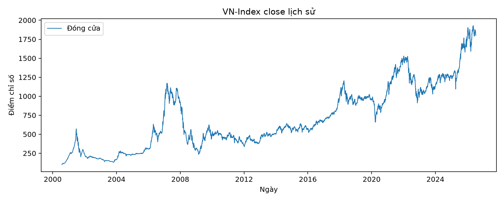

**Nh?n x�t:** Bi?u d? du?c sinh tr?c ti?p t? d? li?u ho?c artifact c?a quick pipeline; kh�ng s? d?ng s? li?u minh h?a gi?.

### L?ch s? drawdown VN-Index

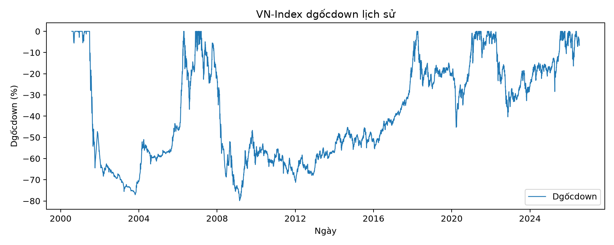

**Nh?n x�t:** Drawdown l?ch s? th? hi?n c�c giai do?n stress r� r?t. MDD head d� b? ch?n ? mi?n kh�ng duong v� kh�ng di?n gi?i q90 l� k?ch b?n nghi�m tr?ng nh?t.

### Bi?n d?ng cu?n chi?u

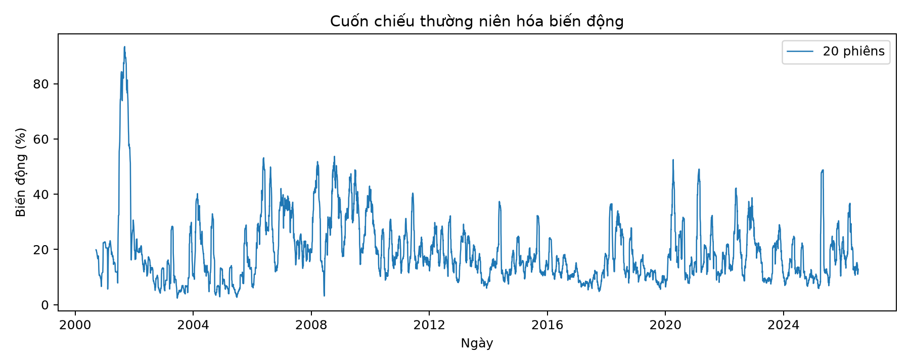

**Nh?n x�t:** Volatility MAE l?n lu?t l� 7.08%, 6.19%, 5.44% cho H5/H20/H60. Sai s? gi?m theo horizon nhung v?n d�ng k?.

### Ph�n ph?i l?i su?t ng�y

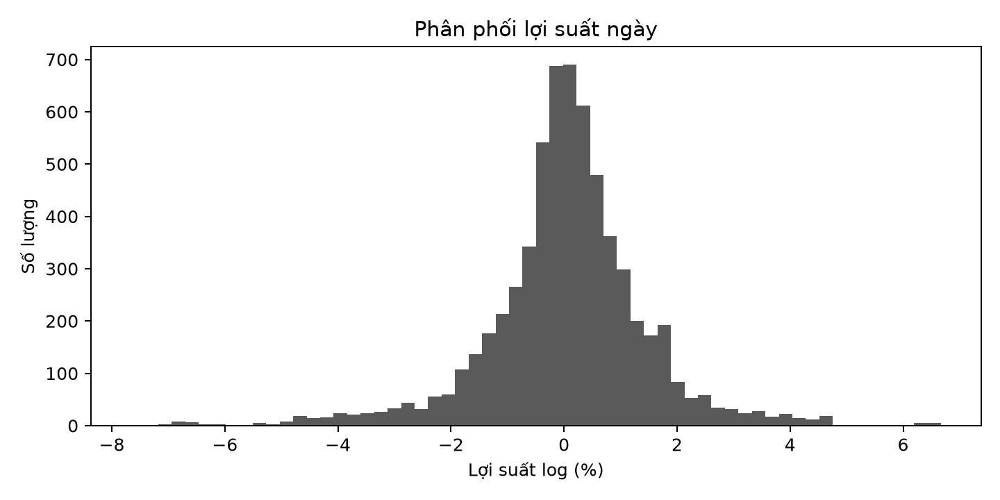

**Nh?n x�t:** Ph�n ph?i l?i su?t c� du�i v� d? ph�n t�n tang theo horizon, l� l� do d�ng quantile regression thay cho gi? d?nh Gaussian c? d?nh.

### T?ng quan ch?t lu?ng d? li?u

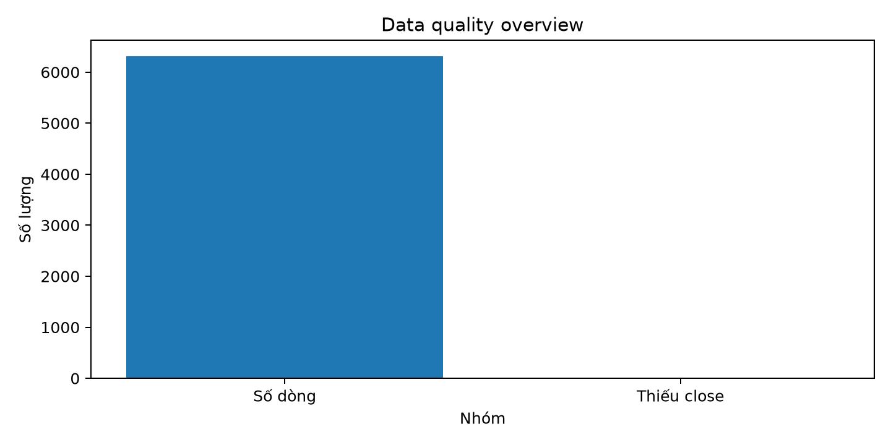

**Nh?n x�t:** C� 6306 phi�n t? 2000-07-28 d?n 2026-07-13. Pipeline ghi nh?n ['OHLC constraint violations: high=27, low=15'] v� kh�ng �m th?m s?a file ngu?n.

### Ph�n ph?i target theo k? h?n

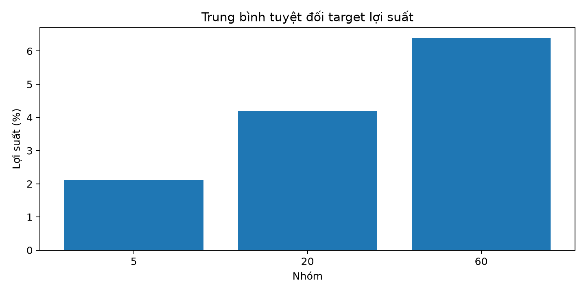

**Nh?n x�t:** Ph�n ph?i l?i su?t c� du�i v� d? ph�n t�n tang theo horizon, l� l� do d�ng quantile regression thay cho gi? d?nh Gaussian c? d?nh.

## Hu?n luy?n

### T?ng loss hu?n luy?n

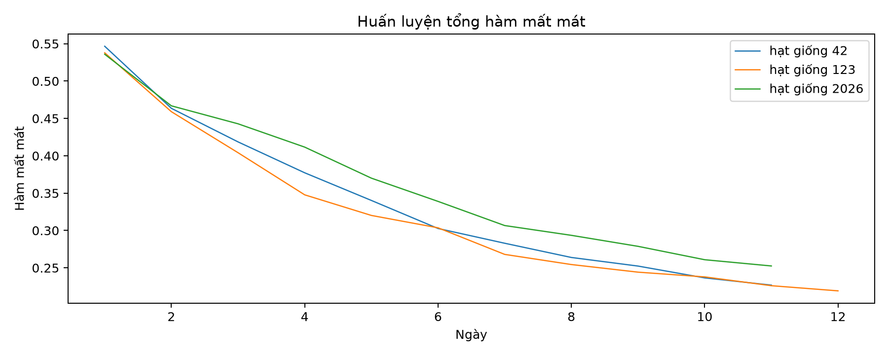

**Nh?n x�t:** Quick run d�ng 1 seed; best epoch l� 1 v?i validation loss 0.3637. M?t seed kh�ng d? d�nh gi� d? ?n d?nh da seed.

### Loss ph�n v? l?i su?t

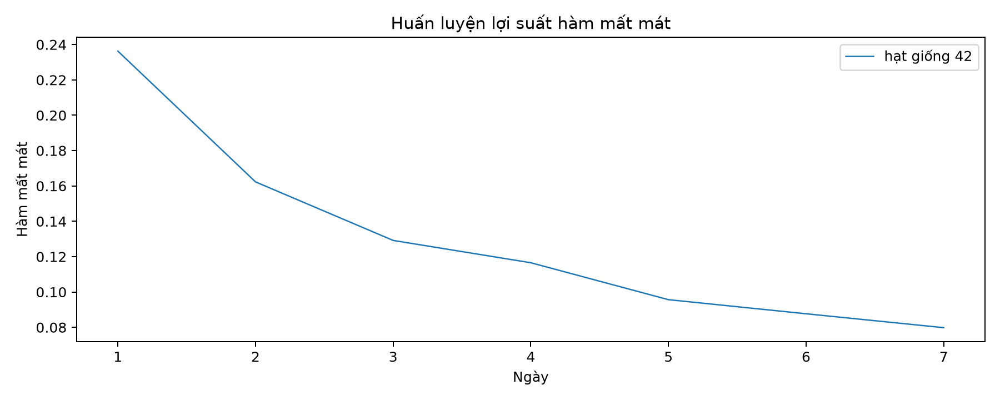

**Nh?n x�t:** Quick run d�ng 1 seed; best epoch l� 1 v?i validation loss 0.3637. M?t seed kh�ng d? d�nh gi� d? ?n d?nh da seed.

### Loss x�c su?t hu?ng

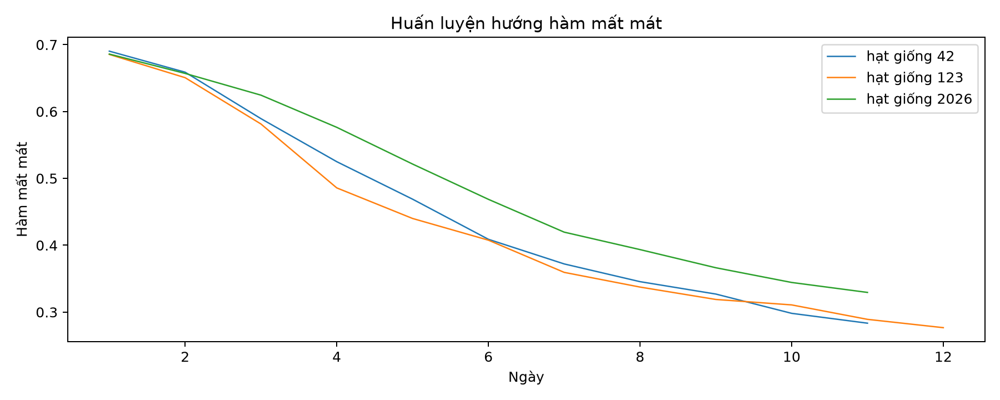

**Nh?n x�t:** Quick run d�ng 1 seed; best epoch l� 1 v?i validation loss 0.3637. M?t seed kh�ng d? d�nh gi� d? ?n d?nh da seed.

### Loss maximum drawdown

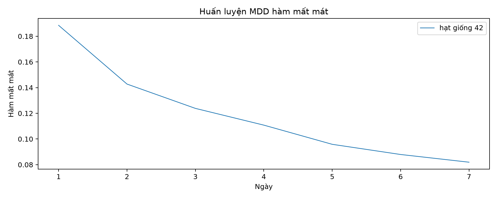

**Nh?n x�t:** Quick run d�ng 1 seed; best epoch l� 1 v?i validation loss 0.3637. M?t seed kh�ng d? d�nh gi� d? ?n d?nh da seed.

### Loss bi?n d?ng

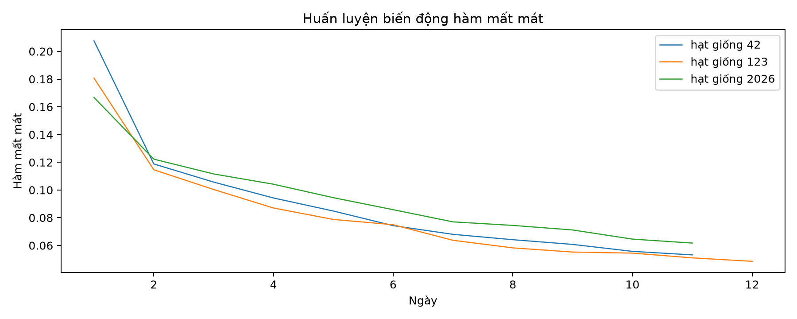

**Nh?n x�t:** Quick run d�ng 1 seed; best epoch l� 1 v?i validation loss 0.3637. M?t seed kh�ng d? d�nh gi� d? ?n d?nh da seed.

### L?ch s? learning rate

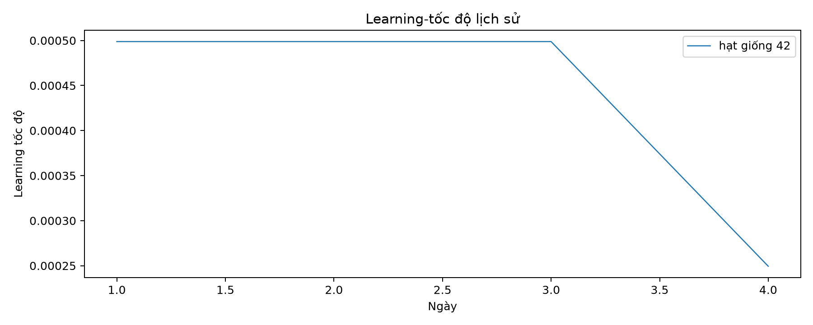

**Nh?n x�t:** Quick run d�ng 1 seed; best epoch l� 1 v?i validation loss 0.3637. M?t seed kh�ng d? d�nh gi� d? ?n d?nh da seed.

### So s�nh validation gi?a c�c seed

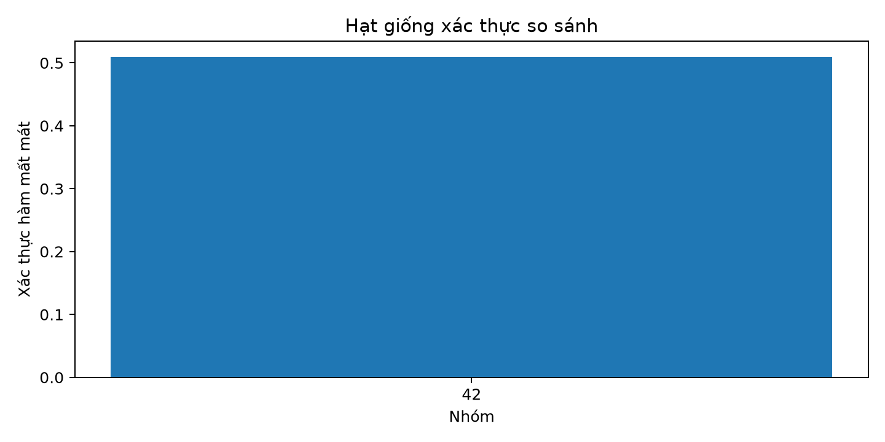

**Nh?n x�t:** Quick run d�ng 1 seed; best epoch l� 1 v?i validation loss 0.3637. M?t seed kh�ng d? d�nh gi� d? ?n d?nh da seed.

## D? b�o l?i su?t

### L?i su?t d? b�o v� th?c t? � 5 phi�n

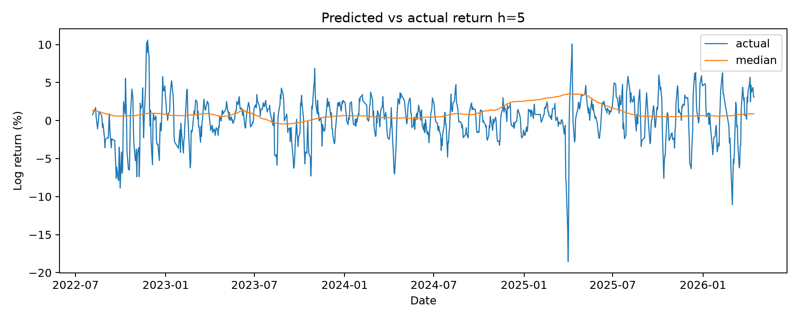

**Nh?n x�t:** MAE k? h?n 5 l� 2.405% v� Spearman 0.047. D? b�o trung v? chua b�m s�t m?nh bi?n d?ng th?c t?; m� h�nh ph� h?p hon v?i m� t? ph�n ph?i r?i ro so v?i d? b�o di?m.

### Bi?u d? qu?t l?i su?t � 5 phi�n

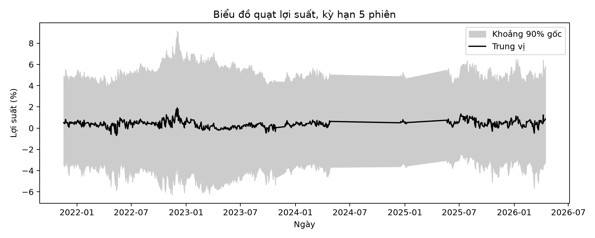

**Nh?n x�t:** Kho?ng g?c d?t coverage 76.5%. Sau conformal, coverage d?t 91.3%, nhung d? r?ng tang t? 6.78% l�n 10.54%.

### Ph?n du l?i su?t � 5 phi�n

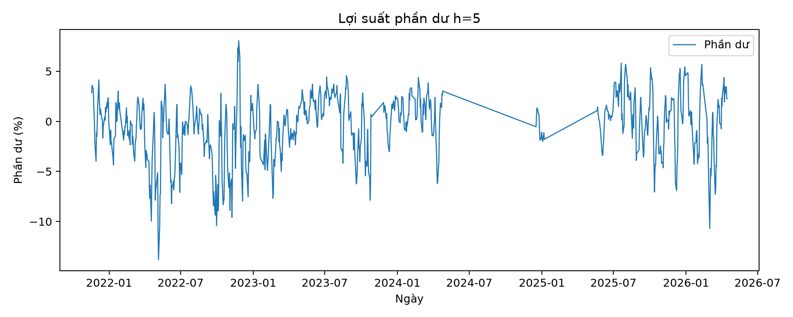

**Nh?n x�t:** Ph?n du k? h?n 5 ph?n �nh sai s? d? b�o trung v?; RMSE th?c t? l� 3.143%. C�c c?m sai s? l?n cho th?y ?nh hu?ng c?a regime v� volatility clustering.

### L?i su?t d? b�o v� th?c t? � 20 phi�n

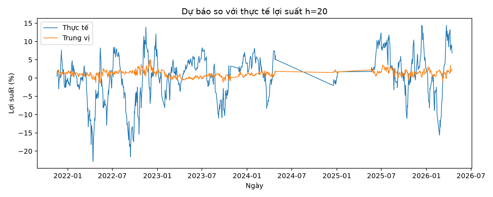

**Nh?n x�t:** MAE k? h?n 20 l� 5.341% v� Spearman 0.069. D? b�o trung v? chua b�m s�t m?nh bi?n d?ng th?c t?; m� h�nh ph� h?p hon v?i m� t? ph�n ph?i r?i ro so v?i d? b�o di?m.

### Bi?u d? qu?t l?i su?t � 20 phi�n

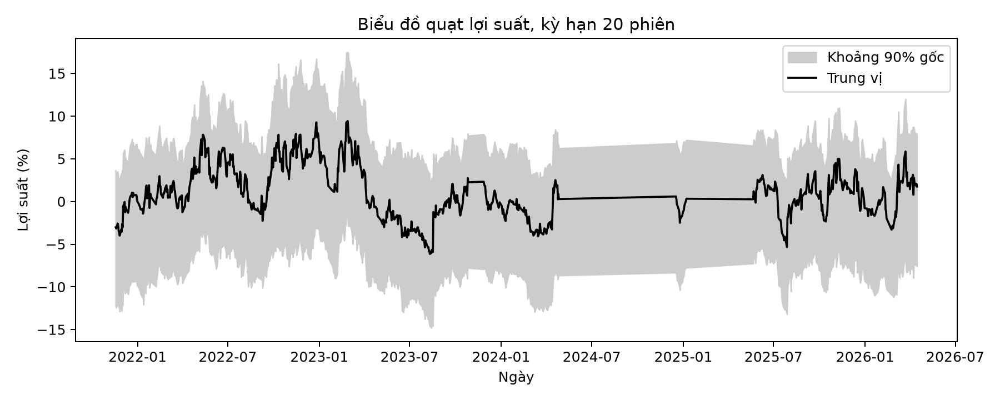

**Nh?n x�t:** Kho?ng g?c d?t coverage 77.2%. Sau conformal, coverage d?t 91.4%, nhung d? r?ng tang t? 15.82% l�n 22.62%.

### Ph?n du l?i su?t � 20 phi�n

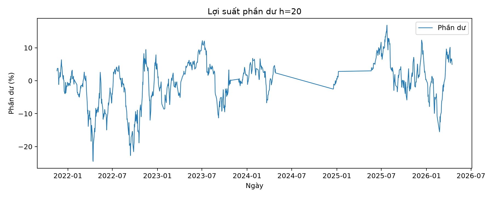

**Nh?n x�t:** Ph?n du k? h?n 20 ph?n �nh sai s? d? b�o trung v?; RMSE th?c t? l� 6.725%. C�c c?m sai s? l?n cho th?y ?nh hu?ng c?a regime v� volatility clustering.

### L?i su?t d? b�o v� th?c t? � 60 phi�n

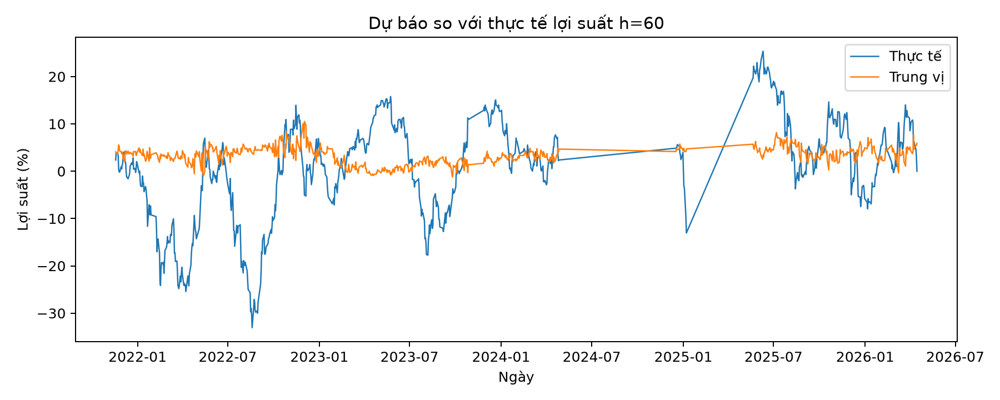

**Nh?n x�t:** MAE k? h?n 60 l� 9.246% v� Spearman 0.059. D? b�o trung v? chua b�m s�t m?nh bi?n d?ng th?c t?; m� h�nh ph� h?p hon v?i m� t? ph�n ph?i r?i ro so v?i d? b�o di?m.

### Bi?u d? qu?t l?i su?t � 60 phi�n


**Nh?n x�t:** Kho?ng g?c d?t coverage 79.8%. Sau conformal, coverage d?t 95.5%, nhung d? r?ng tang t? 31.43% l�n 46.01%.

### Ph?n du l?i su?t � 60 phi�n

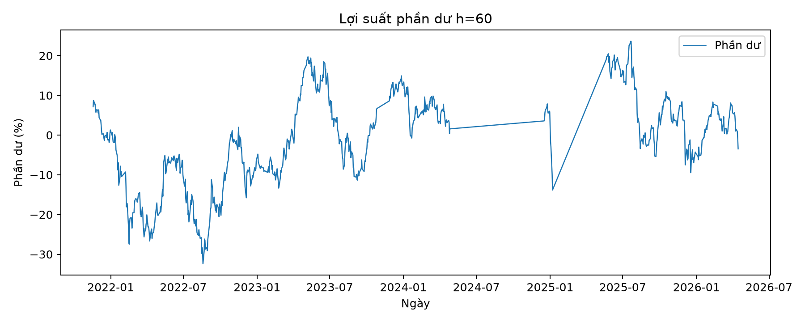

**Nh?n x�t:** Ph?n du k? h?n 60 ph?n �nh sai s? d? b�o trung v?; RMSE th?c t? l� 11.560%. C�c c?m sai s? l?n cho th?y ?nh hu?ng c?a regime v� volatility clustering.

## Hi?u ch?nh conformal

### Coverage cu?n chi?u � 5 phi�n

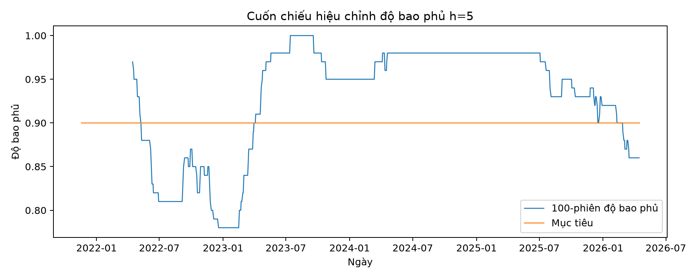

**Nh?n x�t:** Coverage cu?n chi?u k? h?n 5 kh�ng ?n d?nh tuy?t d?i theo th?i gian. Coverage t?ng th? sau hi?u ch?nh l� 91.3%; d�y l� coverage th?c nghi?m, kh�ng ph?i b?o d?m iid.

### Coverage cu?n chi?u � 20 phi�n

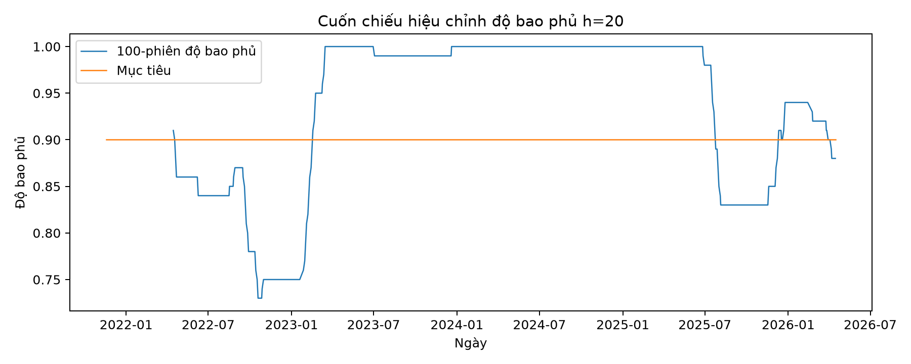

**Nh?n x�t:** Coverage cu?n chi?u k? h?n 20 kh�ng ?n d?nh tuy?t d?i theo th?i gian. Coverage t?ng th? sau hi?u ch?nh l� 91.4%; d�y l� coverage th?c nghi?m, kh�ng ph?i b?o d?m iid.

### Coverage cu?n chi?u � 60 phi�n

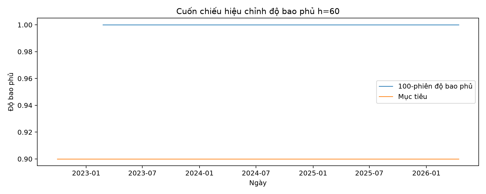

**Nh?n x�t:** Coverage cu?n chi?u k? h?n 60 kh�ng ?n d?nh tuy?t d?i theo th?i gian. Coverage t?ng th? sau hi?u ch?nh l� 95.5%; d�y l� coverage th?c nghi?m, kh�ng ph?i b?o d?m iid.

### Coverage tru?c v� sau conformal

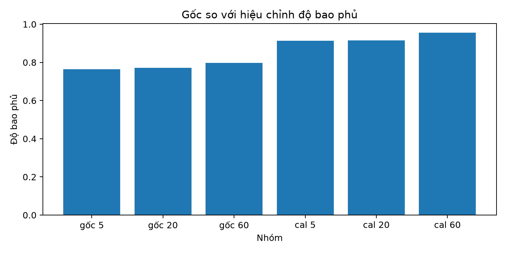

**Nh?n x�t:** Conformal c?i thi?n d? bao ph? nhung l�m kho?ng r?ng hon, d?c bi?t ? k? h?n d�i. Gi� tr? ch�nh l� m� t? b?t d?nh; d? s?c n�t c?a d? b�o gi?m khi y�u c?u coverage cao.

### �? r?ng kho?ng theo k? h?n

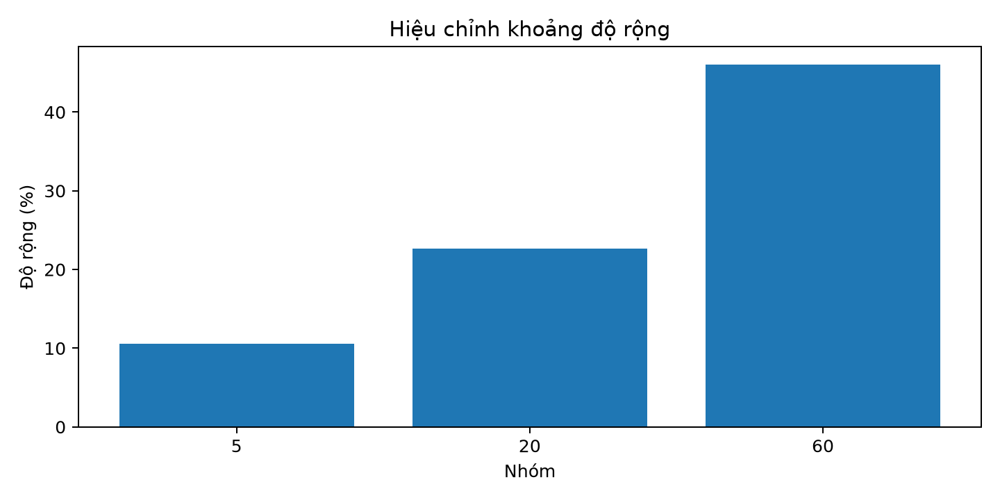

**Nh?n x�t:** Conformal c?i thi?n d? bao ph? nhung l�m kho?ng r?ng hon, d?c bi?t ? k? h?n d�i. Gi� tr? ch�nh l� m� t? b?t d?nh; d? s?c n�t c?a d? b�o gi?m khi y�u c?u coverage cao.

### Interval score theo k? h?n


**Nh?n x�t:** Conformal c?i thi?n d? bao ph? nhung l�m kho?ng r?ng hon, d?c bi?t ? k? h?n d�i. Gi� tr? ch�nh l� m� t? b?t d?nh; d? s?c n�t c?a d? b�o gi?m khi y�u c?u coverage cao.

### Coverage theo tr?ng th�i bi?n d?ng

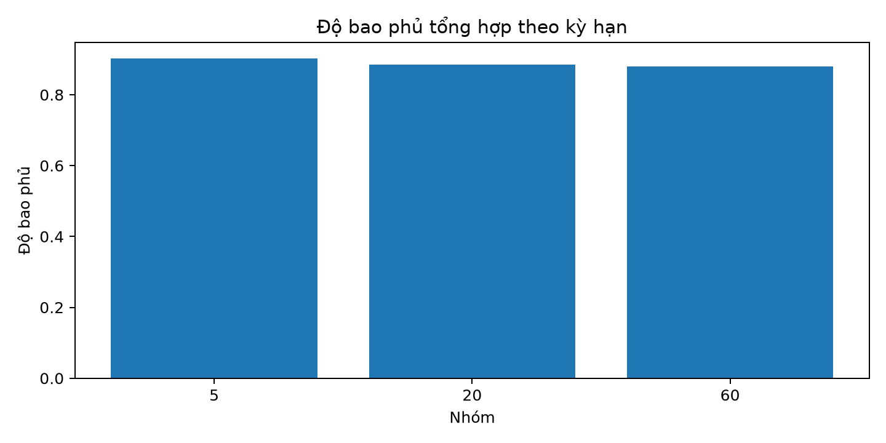

**Nh?n x�t:** Conformal c?i thi?n d? bao ph? nhung l�m kho?ng r?ng hon, d?c bi?t ? k? h?n d�i. Gi� tr? ch�nh l� m� t? b?t d?nh; d? s?c n�t c?a d? b�o gi?m khi y�u c?u coverage cao.

### So s�nh coverage

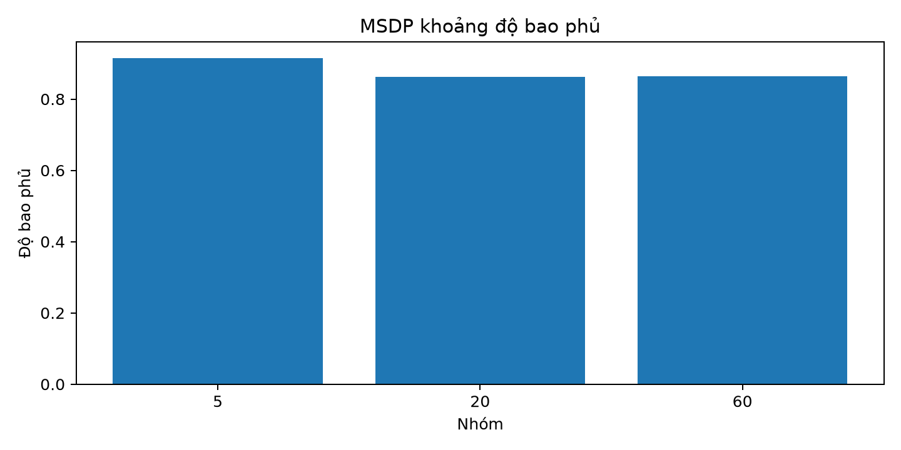

**Nh?n x�t:** Conformal c?i thi?n d? bao ph? nhung l�m kho?ng r?ng hon, d?c bi?t ? k? h?n d�i. Gi� tr? ch�nh l� m� t? b?t d?nh; d? s?c n�t c?a d? b�o gi?m khi y�u c?u coverage cao.

### So s�nh interval score

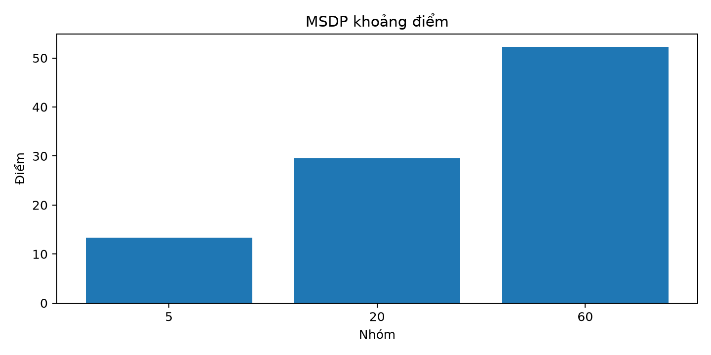

**Nh?n x�t:** Conformal c?i thi?n d? bao ph? nhung l�m kho?ng r?ng hon, d?c bi?t ? k? h?n d�i. Gi� tr? ch�nh l� m� t? b?t d?nh; d? s?c n�t c?a d? b�o gi?m khi y�u c?u coverage cao.

## X�c su?t hu?ng

### �? tin c?y x�c su?t hu?ng � 5 phi�n

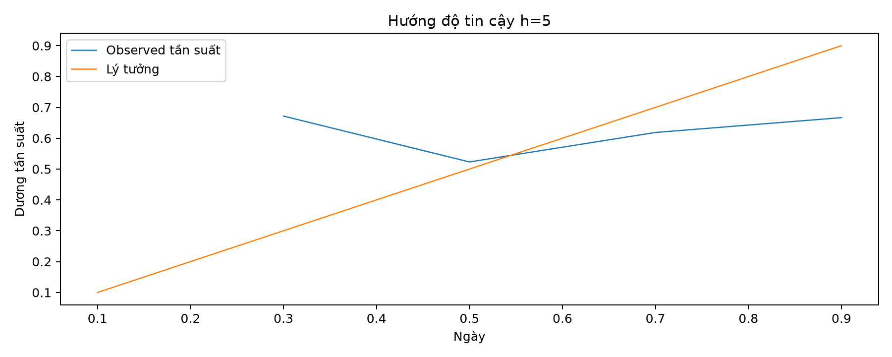

**Nh?n x�t:** Brier score k? h?n 5 l� 0.2564, ROC AUC 0.533. X�c su?t c� th�ng tin h?n ch? v� chua t?o ph�n t�ch l?p m?nh.

### �? tin c?y x�c su?t hu?ng � 20 phi�n

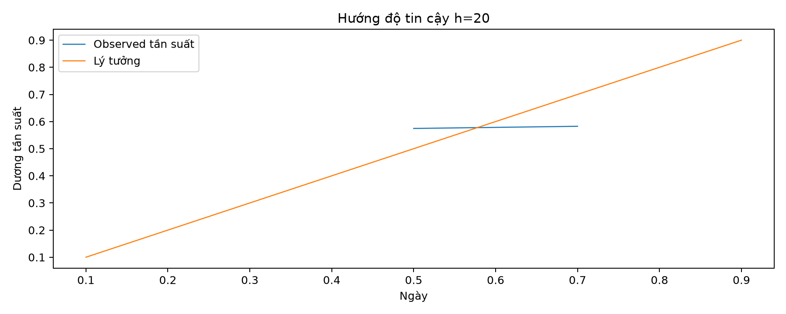

**Nh?n x�t:** Brier score k? h?n 20 l� 0.2528, ROC AUC 0.545. X�c su?t c� th�ng tin h?n ch? v� chua t?o ph�n t�ch l?p m?nh.

### �? tin c?y x�c su?t hu?ng � 60 phi�n

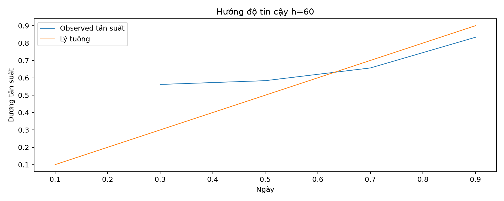

**Nh?n x�t:** Brier score k? h?n 60 l� 0.2488, ROC AUC 0.525. X�c su?t c� th�ng tin h?n ch? v� chua t?o ph�n t�ch l?p m?nh.

### X�c su?t tang v� k?t qu? th?c t?

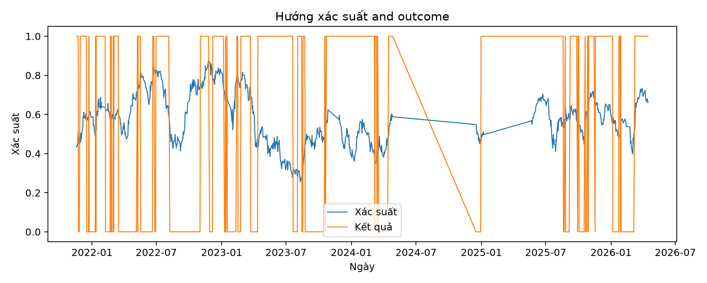

**Nh?n x�t:** Brier gi?m so v?i ZeroReturn ? c? ba k? h?n, nhung balanced accuracy v?n g?n v�ng 0,5. Kh�ng n�n di?n gi?i x�c su?t tang nhu t�n hi?u giao d?ch ch?c ch?n.

### Brier score theo k? h?n

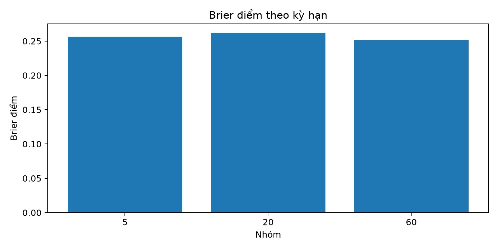

**Nh?n x�t:** Brier gi?m so v?i ZeroReturn ? c? ba k? h?n, nhung balanced accuracy v?n g?n v�ng 0,5. Kh�ng n�n di?n gi?i x�c su?t tang nhu t�n hi?u giao d?ch ch?c ch?n.

### So s�nh Brier v?i baseline

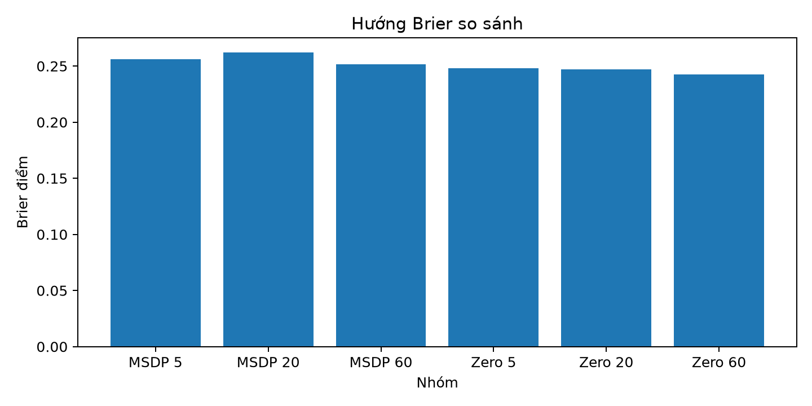

**Nh?n x�t:** Brier gi?m so v?i ZeroReturn ? c? ba k? h?n, nhung balanced accuracy v?n g?n v�ng 0,5. Kh�ng n�n di?n gi?i x�c su?t tang nhu t�n hi?u giao d?ch ch?c ch?n.

## Expert v� gate

### Tr?ng s? gate � 5 phi�n

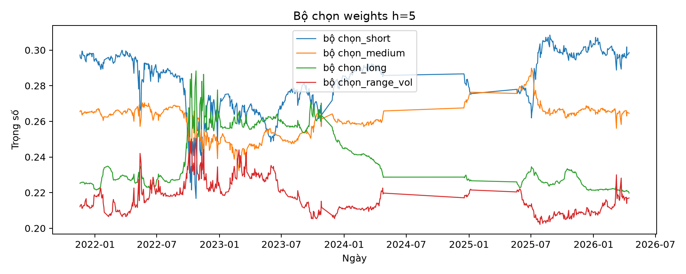

**Nh?n x�t:** Expert c� tr?ng s? trung b�nh cao nh?t l� `medium` (0.314). K?t qu? chua h? tr? gi? thuy?t short expert chi ph?i k? h?n 5 phi�n.

### D? b�o ri�ng t?ng expert � 5 phi�n

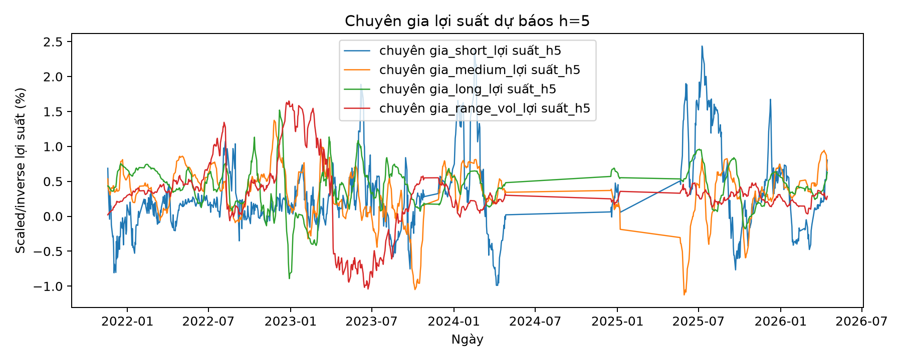

**Nh?n x�t:** �? l?ch chu?n trung b�nh gi?a auxiliary expert forecasts ? k? h?n 5 l� 0.436%. ��y l� b?t d?ng d? b�o, kh�c v?i entropy c?a tr?ng s? gate.

### Tr?ng s? gate � 20 phi�n

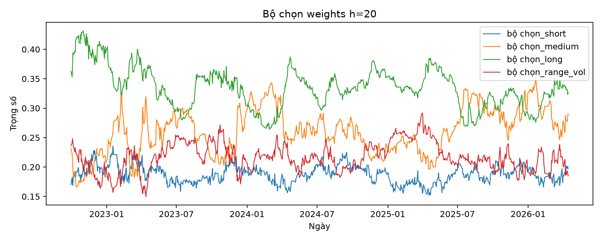

**Nh?n x�t:** Expert c� tr?ng s? trung b�nh cao nh?t l� `medium` (0.321). Long expert tang vai tr� ? k? h?n d�i, nhung m?c ph�n h�a gate v?n tuong d?i th?p.

### D? b�o ri�ng t?ng expert � 20 phi�n

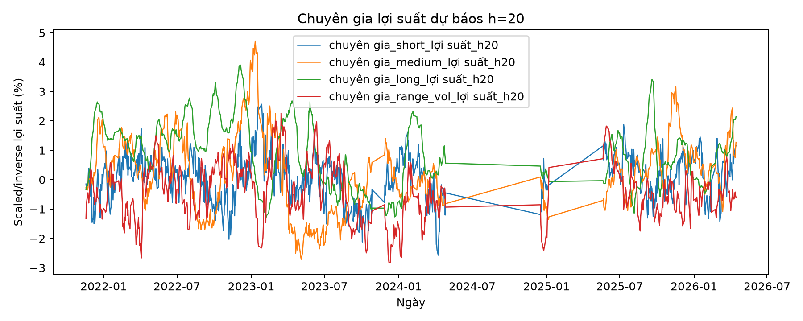

**Nh?n x�t:** �? l?ch chu?n trung b�nh gi?a auxiliary expert forecasts ? k? h?n 20 l� 0.901%. ��y l� b?t d?ng d? b�o, kh�c v?i entropy c?a tr?ng s? gate.

### Tr?ng s? gate � 60 phi�n

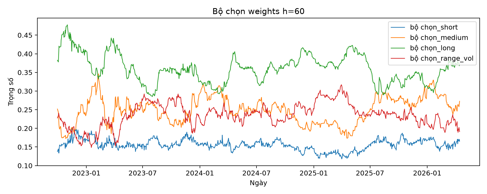

**Nh?n x�t:** Expert c� tr?ng s? trung b�nh cao nh?t l� `long` (0.313). Long expert tang vai tr� ? k? h?n d�i, nhung m?c ph�n h�a gate v?n tuong d?i th?p.

### D? b�o ri�ng t?ng expert � 60 phi�n

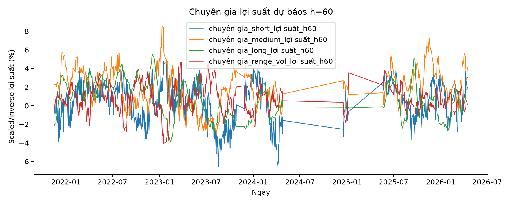

**Nh?n x�t:** �? l?ch chu?n trung b�nh gi?a auxiliary expert forecasts ? k? h?n 60 l� 1.575%. ��y l� b?t d?ng d? b�o, kh�c v?i entropy c?a tr?ng s? gate.

### Tr?ng s? gate trung b�nh

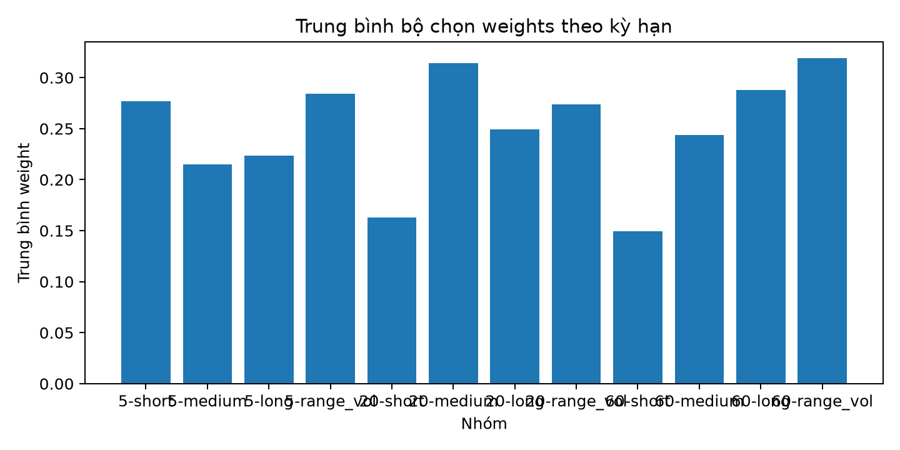

**Nh?n x�t:** Gate c� xu hu?ng g?n tr?ng s? d?u; long expert nh?n tr?ng s? cao nh?t ? c? ba k? h?n. Learned gate chua ch?ng minh gi� tr? vu?t equal-weight trong quick ablation.

### Entropy gate chu?n h�a

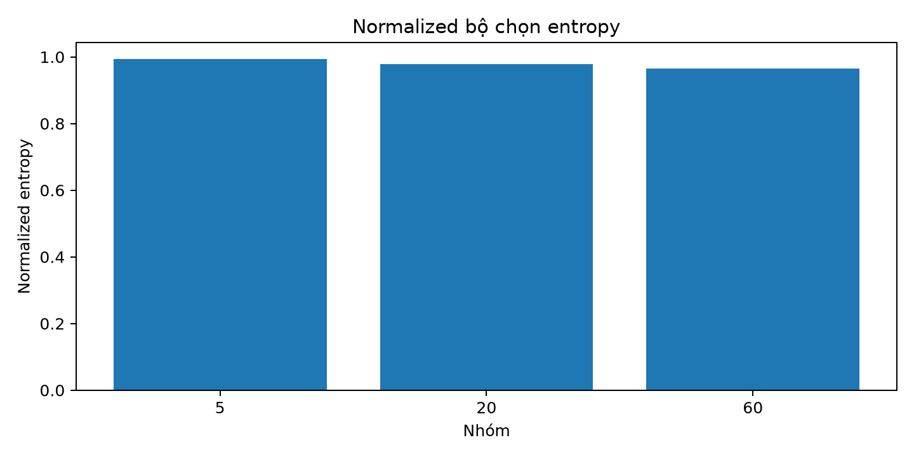

**Nh?n x�t:** Gate c� xu hu?ng g?n tr?ng s? d?u; long expert nh?n tr?ng s? cao nh?t ? c? ba k? h?n. Learned gate chua ch?ng minh gi� tr? vu?t equal-weight trong quick ablation.

### M?c b?t d?ng gi?a c�c expert

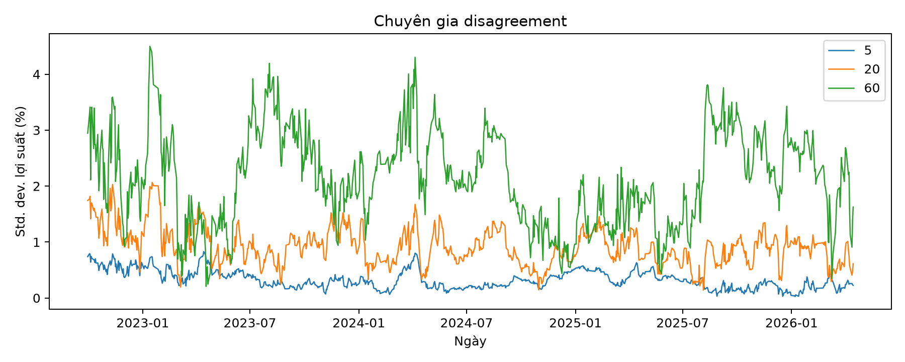

**Nh?n x�t:** Gate c� xu hu?ng g?n tr?ng s? d?u; long expert nh?n tr?ng s? cao nh?t ? c? ba k? h?n. Learned gate chua ch?ng minh gi� tr? vu?t equal-weight trong quick ablation.

### Tuong quan d? b�o gi?a c�c expert

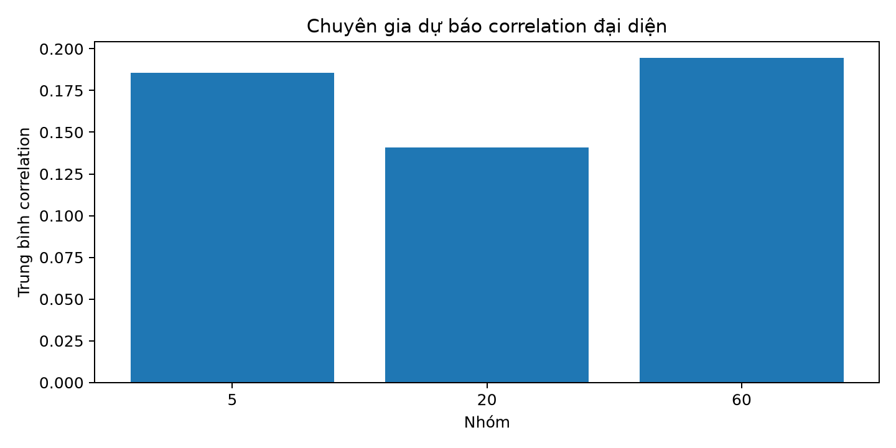

**Nh?n x�t:** Gate c� xu hu?ng g?n tr?ng s? d?u; long expert nh?n tr?ng s? cao nh?t ? c? ba k? h?n. Learned gate chua ch?ng minh gi� tr? vu?t equal-weight trong quick ablation.

### M?c s? d?ng expert

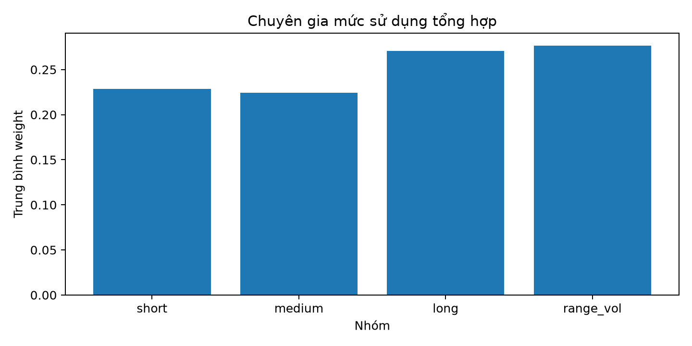

**Nh?n x�t:** Gate c� xu hu?ng g?n tr?ng s? d?u; long expert nh?n tr?ng s? cao nh?t ? c? ba k? h?n. Learned gate chua ch?ng minh gi� tr? vu?t equal-weight trong quick ablation.

### Gate m?i nh?t

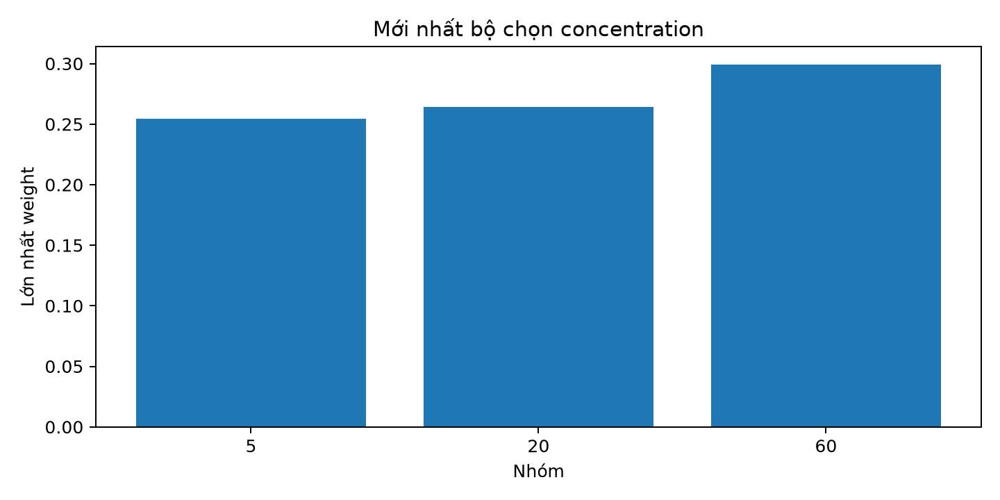

**Nh?n x�t:** Gate c� xu hu?ng g?n tr?ng s? d?u; long expert nh?n tr?ng s? cao nh?t ? c? ba k? h?n. Learned gate chua ch?ng minh gi� tr? vu?t equal-weight trong quick ablation.

## R?i ro

### MDD d? b�o v� th?c t? � 5 phi�n

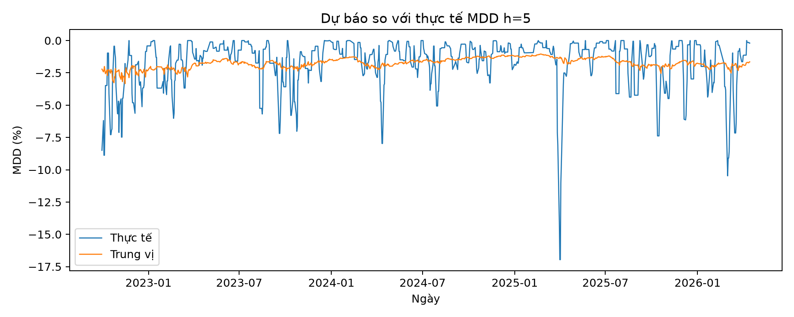

**Nh?n x�t:** MDD MAE k? h?n 5 l� 1.528%. q10 bi?u di?n k?ch b?n drawdown x?u hon, c�n q90 g?n 0 hon; to�n b? quantile d� du?c audit kh�ng duong.

### MDD d? b�o v� th?c t? � 20 phi�n

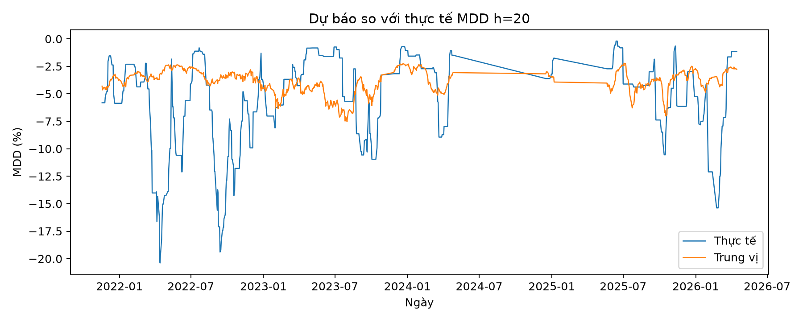

**Nh?n x�t:** MDD MAE k? h?n 20 l� 3.149%. q10 bi?u di?n k?ch b?n drawdown x?u hon, c�n q90 g?n 0 hon; to�n b? quantile d� du?c audit kh�ng duong.

### MDD d? b�o v� th?c t? � 60 phi�n

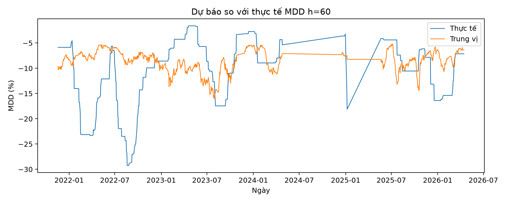

**Nh?n x�t:** MDD MAE k? h?n 60 l� 4.985%. q10 bi?u di?n k?ch b?n drawdown x?u hon, c�n q90 g?n 0 hon; to�n b? quantile d� du?c audit kh�ng duong.

### Bi?n d?ng d? b�o v� th?c t?

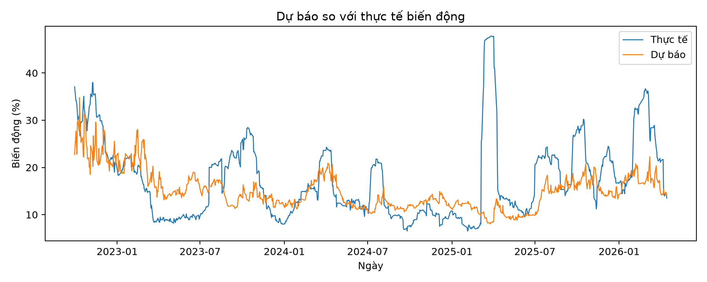

**Nh?n x�t:** Volatility MAE l?n lu?t l� 7.08%, 6.19%, 5.44% cho H5/H20/H60. Sai s? gi?m theo horizon nhung v?n d�ng k?.

### T?n su?t vu?t ngu?ng MDD

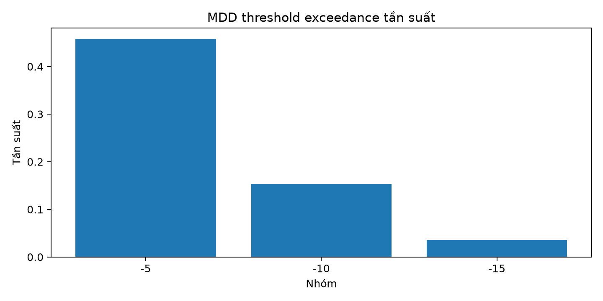

**Nh?n x�t:** Drawdown l?ch s? th? hi?n c�c giai do?n stress r� r?t. MDD head d� b? ch?n ? mi?n kh�ng duong v� kh�ng di?n gi?i q90 l� k?ch b?n nghi�m tr?ng nh?t.

## So s�nh m� h�nh

### So s�nh pinball v?i baseline

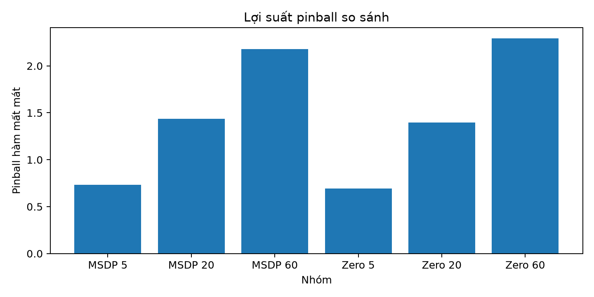

**Nh?n x�t:** H5 v� H20 c� pinball k�m ZeroReturn; H60 c� pinball t?t hon nhung MAE k�m hon. Kh�ng c� c?i thi?n nh?t qu�n tr�n m?i metric v� horizon.

### K?t qu? ablation

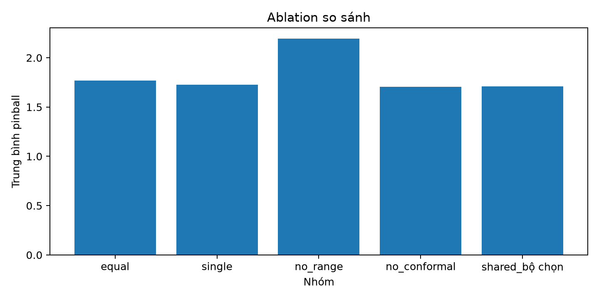

**Nh?n x�t:** Equal-weight d?t mean pinball 1.9507, th?p hon Full MSDP kho?ng 1.8184; single-scale d?t 1.6853. Learned gate chua vu?t equal-weight.

### Kho?ng tin c?y bootstrap

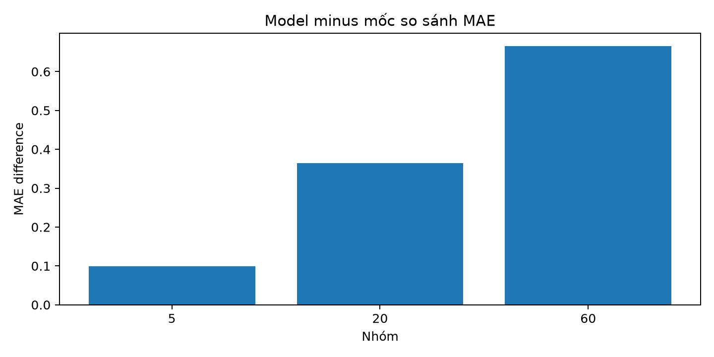

**Nh?n x�t:** Conformal c?i thi?n d? bao ph? nhung l�m kho?ng r?ng hon, d?c bi?t ? k? h?n d�i. Gi� tr? ch�nh l� m� t? b?t d?nh; d? s?c n�t c?a d? b�o gi?m khi y�u c?u coverage cao.

### Hi?u nang theo di?u ki?n th? tru?ng

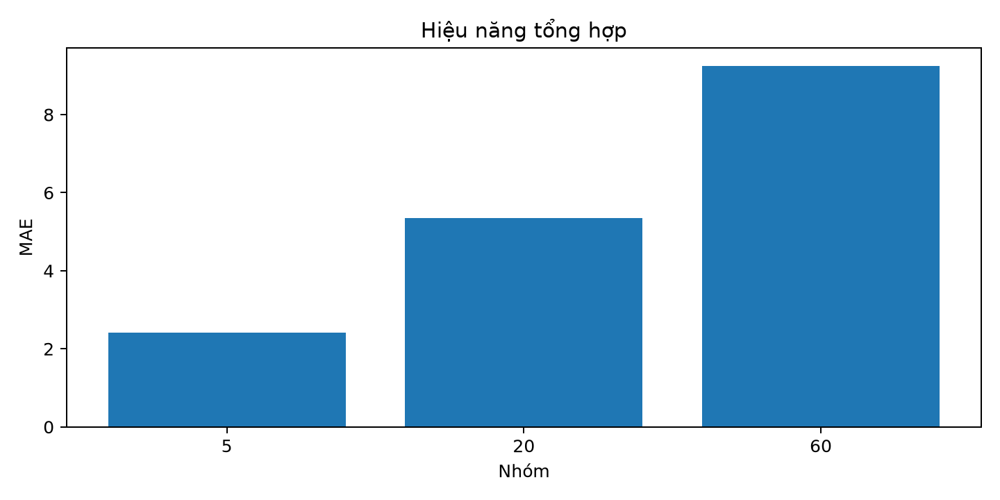

**Nh?n x�t:** Bi?u d? du?c sinh tr?c ti?p t? d? li?u ho?c artifact c?a quick pipeline; kh�ng s? d?ng s? li?u minh h?a gi?.

### �? ?n d?nh theo seed

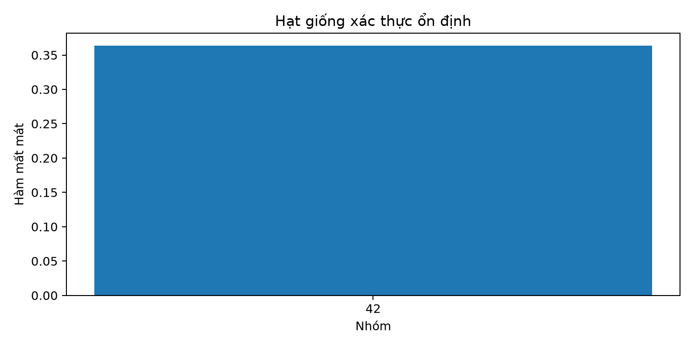

**Nh?n x�t:** Quick run d�ng 1 seed; best epoch l� 1 v?i validation loss 0.3637. M?t seed kh�ng d? d�nh gi� d? ?n d?nh da seed.

## D? b�o m?i nh?t

### H? so l?i su?t m?i nh?t

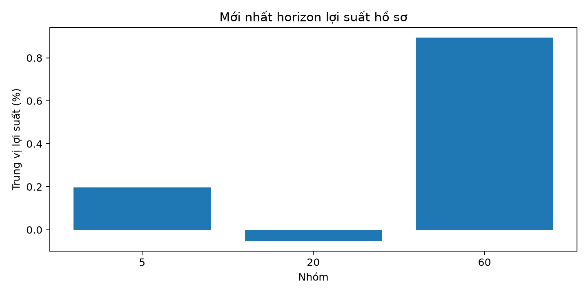

**Nh?n x�t:** H? so ng�y 2026-07-13 00:00:00 cho th?y median return duong ? c? ba horizon, nhung calibrated interval d?u bao g?m 0 v� m? r?ng m?nh theo k? h?n. ��y kh�ng ph?i du?ng gi� tuong lai hay khuy?n ngh? mua b�n.

### Kho?ng ch? s? d? ph�ng m?i nh?t

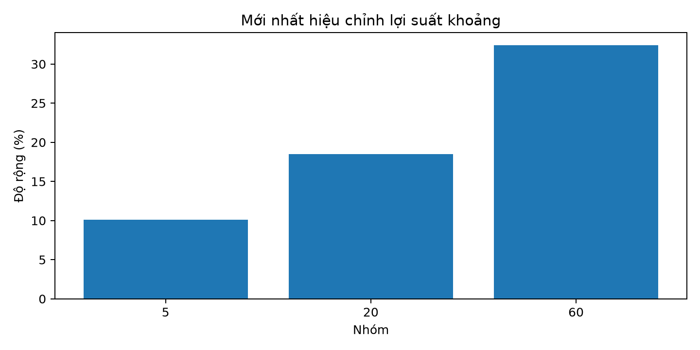

**Nh?n x�t:** Conformal c?i thi?n d? bao ph? nhung l�m kho?ng r?ng hon, d?c bi?t ? k? h?n d�i. Gi� tr? ch�nh l� m� t? b?t d?nh; d? s?c n�t c?a d? b�o gi?m khi y�u c?u coverage cao.

### H? so r?i ro m?i nh?t

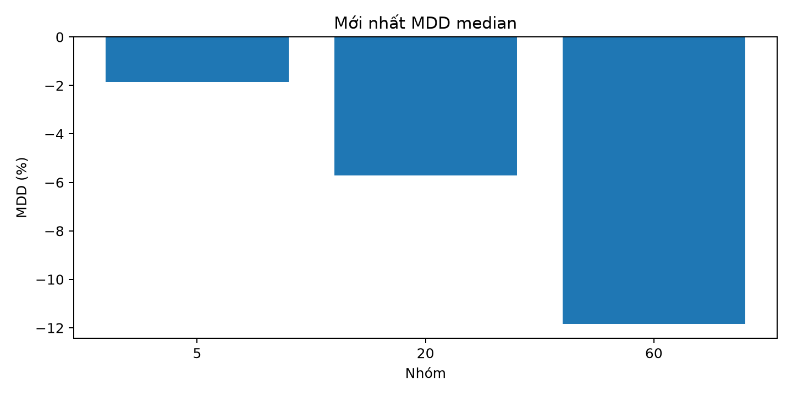

**Nh?n x�t:** H? so ng�y 2026-07-13 00:00:00 cho th?y median return duong ? c? ba horizon, nhung calibrated interval d?u bao g?m 0 v� m? r?ng m?nh theo k? h?n. ��y kh�ng ph?i du?ng gi� tuong lai hay khuy?n ngh? mua b�n.

### C�c th�nh ph?n confidence m?i nh?t

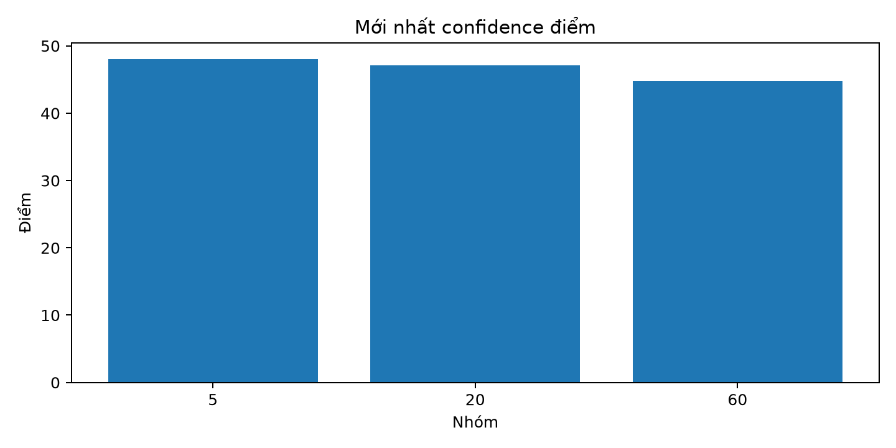

**Nh?n x�t:** H? so ng�y 2026-07-13 00:00:00 cho th?y median return duong ? c? ba horizon, nhung calibrated interval d?u bao g?m 0 v� m? r?ng m?nh theo k? h?n. ��y kh�ng ph?i du?ng gi� tuong lai hay khuy?n ngh? mua b�n.

## T�i li?u chi ti?t

- [B�o c�o nghi�n c?u d?y d?](reports/MSDP_BAO_CAO_DAY_DU_VI.md)
- [Nh?n x�t k?t qu?](reports/MSDP_NHAN_XET_KET_QUA_VI.md)
- [Review repository](reports/MSDP_REPOSITORY_REVIEW_VI.md)
- [K?t qu? ki?m th?](reports/test_results.txt)
- [H?n ch?](reports/MSDP_LIMITATIONS_VI.md)

## Tuy�n b? mi?n tr? tr�ch nhi?m

Kh�ng s? d?ng k?t qu? nhu b?o d?m l?i nhu?n ho?c l?i khuy�n mua b�n. Ngu?i d�ng t? ch?u tr�ch nhi?m ki?m tra d? li?u, gi? d?nh, chi ph� giao d?ch v� r?i ro th? tru?ng.
